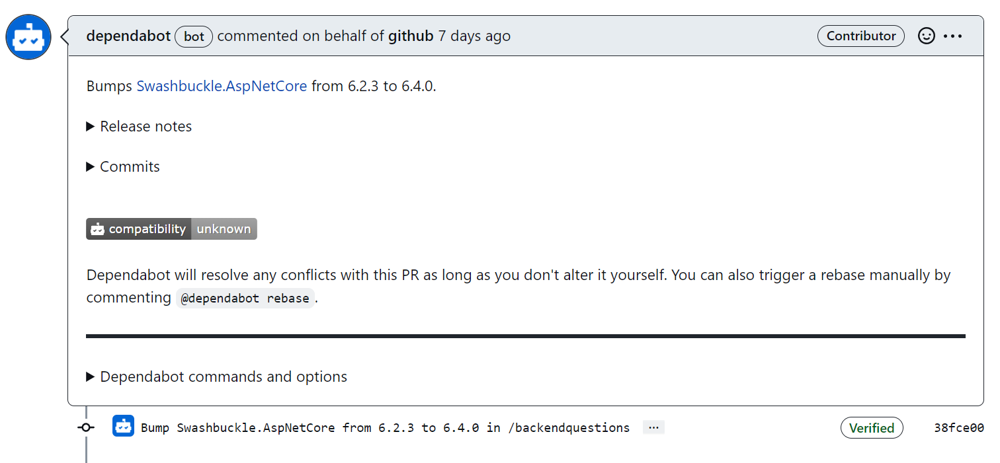

---
<h1 align="center"> DevSecOps document </h1>
<h2 align="center"> Blind date </h2>
<h5 align="center"> Project Assignment by - <a href="https://fontys.nl">Fontys Pedagogy</a></h5>

---

<!-- markdownlint-disable -->


<table align="center" class="no-border" >
  <tr>
    <td></td>
    <td></td>
    <td></td>
  </tr>
</table>

---

<!-- TABLE OF CONTENTS -->
<h2 id="table-of-contents"> :book: Table of Contents</h2>

<details open="open">
  <summary>Table of Contents</summary>
  <ol>
    <li><a href="#introduction"> ➤ Introduction</a></li>
    <li><a href="#CI-pipeline"> ➤ Continious integration</a></li>
    <li><a href="#Security"> ➤ Security</a></li>
    <li><a href="#CD-pipeline"> ➤ Continious deployment</a></li>
    <li><a href="#used-tools"> ➤ Used tools</a></li>
    <li><a href="#getting-started"> ➤ Links</a></li>
  </ol>
</details>

---

<!-- ABOUT THE PROJECT -->
<h2 id="introduction"> :pencil: introduction</h2>

<p align="justify"> 
With building a product for Fontys Pedagogy, the pace can go quite fast. So, it is quite wanted to have automated processes that can do work for us such as:
    <li>Builds of projects</li>
    <li>Automated performing tests (Unit test, System test, Integration test etc.)</li>
    <li>Security checks</li>
    <li>Code analysis for code smells and security vulnerabillities.</li>
    <li>Check for new dependency versions.</li>
</p>

---

<!-- OVERVIEW -->
<h2 id="CI-pipeline"> :wrench: Continious integration</h2>
<h4>Goal of using continious integration.</h4>

Our goal here is to prepare the code for a possible release in the deployment pipeline. So, the code will undergo a couple of stages of testing and analysis to give the developer and its team feedback on the new code. The change in code may result some re-factoring to accomplish the needs of the enviroment in order to make the code work in different target enviroments, when the checks of testing and analysis fails. And with the usage of this continious integration pipeline, we can make sure to identify which builds are considered 'healty' for the production environment. As the builds succeeds or fails, these results will be marked down and archived as a whole artifact in the asset. 


<h4>Find the CI-pipeline documents.</h4>

The script files can be found in the repository of blind date: <a href="https://github.com/BlindDate-Org/S6_Blind_Date_Platform/tree/main/.github">URL: Blind-date repository</a>
This contains the yml files of the backend configuration, frontend configuration and sonarcloud integration with this project.

Keep in mind that all GitHub actions documents needs to bbe placed under the ```github``` folder. This keeps the work efficiency up and let GitHub find the corresponding files. So, when something needs to be updated, it can be found there


<h4>Usage of continious integration.</h4>

These jobs get triggered dependend on the project as we have new push or pull-request within the microservices of this project. The general ruleset of triggering the CI-pipeline are:

<li>push: only on the [main-branch]</li>
<li>pull-requests to [main-branch] only. </li>
&nbsp


```yml
name: Node.js CI

# Controls when the workflow will run
on:
  # Triggers the workflow on push or pull request events but only for the "main" branch
  push:
    branches: ["main"]
    paths: ["frontend/**"]
  pull_request:
    branches: ["main"]
    paths: ["frontend/**"]
```

With the paths described above, this is neccessary to trigger the workflow. If this path needs to be changed in the future, keep in mind that this variable needs to be updated. What this does is it tells the project where to find the project it needs to clone/build, since we are using a ```mono repository structure```.

<h4>Jobs within the Continious integration pipeline.</h4>


Within the CI-pipeline, the following jobs can be performed when the pipeline get triggered:
<li>Build jobs</li>
<li>Test jobs</li>
<li>Security checks</li>
<li>Code analysis</li>
<li>Code coverage</li>


```The build job```checks whether the microservice can build its project on it own and not break. When this build fails, the application is unstable and needs attention before the code gets pushed to the repository. It is neccessary to resolve this issue otherwise the repository contains this instable code-base.

```Test job``` performes the test of the written testdocument. This can be a several tests such as e.g. unit tests or integration tests. These are essential to check if the new push/pull request won't accidentally break any other features of the microservice. 

```Security checks``` will be performed with a tool named: ```SONAR CLOUD```. This tool will check the whole codebase of the microservice and perform several checks in order to validate the security of the application. This gets tested against known software vulnerabillities of OWASP. A result of a security issue within ```SONAR CLOUD``` can look like this: 
<p align="center"> 
  
</p>
&nbsp

```Code analysis``` will perform several checks on the codebase of the microservice. This is also performed by the tool: ```Sonarcloud```.
This tool will check the code against several bad practices or issues. Such as example given: ```camel cases``` and ```pascal cases```.
This is displayed in the Sonar cloud panel as displayed below: 
<p align="center"> 
  
</p>

---

<h2 id="Security"> :bulb: Security</h2>
We implemented serval tools that keep watch on the code and notify the developers when the code contains possible vulnerabillities. The tools we used keep track of these vulnerabillities and suggest a solution.
<br>
<br>

```Dependabot``` is a tool we used on the GitHub repository that gives us feedback on the used packages version and frameworks. It gives suggestions by pull-request to update the version of the used frameworks/package. An example of a pull-request looks like this:

<p align="center"> 
  
</p>
<p>Assigned a pull-request to update bump version in the backendquestions project.</p>

<p align="center"> 
  
</p>
<p>Gives explanation on the new release notes of the update and will resolve conflicts.</p>


---

<h2 id="CD-pipeline"> :cloud: Continious integration</h2>

---

<h2 id="used-tools"> :open_file_folder: Used tools</h2>
<p align="justify">
    The used tools for this project are as followed:
    <li><a href ="https://github.com/BlindDate-Org" />GitHub Actions</li>
    <li><a href ="https://sonarcloud.io/project/overview?id=BlindDate-Org_S6_Blind_Date_Platform" />Sonar Cloud</li>
    <li><a href ="https://docs.github.com/en/code-security/dependabot/working-with-dependabot/automating-dependabot-with-github-actions" />Dependabot</li>
<p>
